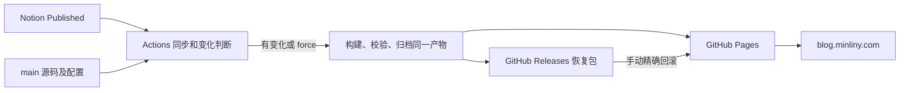

# Deployment

## 发布架构

生产仓库 `minliny/minliny.github.io` 的 `main` 使用 [Deploy Blog](../.github/workflows/deploy-blog.yml) 发布。Notion 是内容源，Actions 负责同步、指纹、构建与校验，GitHub Releases 保存精确站点归档，GitHub Pages 提供静态托管和 HTTPS。读者访问网站时不调用 Notion，也不需要 Node.js、数据库或服务器 API。

正常发布不再调用 SSH。模板仓库只构建 `content/fixtures`，不读取生产内容、Notion 凭据或使用生产环境。`npm run build` 默认是 fixtures；生产构建必须显式使用 `build:notion` 或指定 `.content/notion`。

站点包含预渲染 HTML、CSS、JavaScript、JSON、RSS、sitemap、本地媒体和定制 404。Notion 托管媒体会镜像到本地，正文中其他外部媒体和字体仍可能引用第三方地址；迁移全部静态托管不等于全部外部资源离线化。

## 正常发布流程

1. `main` 推送、手动触发、`notion_publish` 或每小时第 17、47 分钟检查启动工作流。
2. 安装锁定依赖，全量同步 `Published` 内容；生产拒绝错误空快照。
3. 校验实际文件与源 manifest，计算稳定内容、生成器和发布指纹，排除抓取时间。
4. 指纹相同仍核验可信 Release 并检查当前站点，不能以线上两个旧缓存相同作为成功证据。
5. 新的或未验证生成器先通过测试；实际变化或 `force=true` 时构建并做静态校验，使用 Node.js 24 和正式 canonical `https://blog.minliny.com`。
6. 上传保留 1 天的 Pages 传输 artifact，从同一产物归档 `site.tar.gz`、`release-manifest.json`、`SHA256SUMS` 至唯一 Release tag。
7. 核验完整归档，重新检查暂停状态及 `main` 是否已前进，再激活 Pages；旧候选不能覆盖更新的源码。
8. 按本次归档的身份、文件 hash、canonical、路由与 MIME 做单站公网检查。

归档、Pages 激活、公网检查是独立阶段。Release 在 Pages 激活前公开，Published 候选可能先被下载；工作流失败不代表内容从未公开。改回 Draft 只影响后续网站，彻底撤稿还需检查历史 Release 和备份。留存和回滚操作见 [BLOG_PUBLISHING.md](../BLOG_PUBLISHING.md)。

## 必需配置

| 配置位置 | 名称或值 | 用途 |
| --- | --- | --- |
| Repository Secrets | `NOTION_TOKEN`、`NOTION_DATABASE_ID` | 只用于可信生产内容同步 |
| Repository Variables | `BLOG_PUBLISH_PAUSED=true/false` | 缺失或非法值拒绝生产激活；`force` 不绕过暂停 |
| Repository Variables | `BLOG_SMOKE_BASE_URL` | 切域前 `https://minliny.github.io`，切域后 `https://blog.minliny.com` |
| Workflow env | `SITE_URL=https://blog.minliny.com` | 构建 canonical、Open Graph、RSS、sitemap、manifest、robots |
| Workflow env | `ALLOW_EMPTY_NOTION_SYNC=0` | 防止错误空快照清空网站 |
| Environment | `github-pages` | 限制可信 `main`，供正常发布和回滚使用 |
| Pages Settings | Source = GitHub Actions | 保持 Actions 发布来源 |
| Pages Settings | Custom domain = `blog.minliny.com` | 在切域窗口设置，并验收证书和 HTTPS |

Actions 内置 `GITHUB_TOKEN` 按 job 权限读归档、写 Release 和部署 Pages。无需新增长期 PAT。不要把真实 Token、`.env`、私钥、原始 `.content/notion` 或 node_modules 放入站点归档。`site.config.json` 的 `repository` 是 `minliny/MoZhu_Blog` 开源入口，不参与 canonical 推导。

## 首次切换的操作顺序

以下步骤是执行门禁，文档本身不证明生产 DNS、首轮发布或服务器退出已完成。每阶段记录时间、源码 commit、run ID、Release、hash、配置和验收结论。

1. 保存恢复基线：导出 Cloudflare `blog` 原始 DNS 类型、目标、代理、TTL 和该主机规则，记录当前 Pages 与源站身份，独立核验并备份旧站点原始产物。公开 DNS 的 Cloudflare edge IP 不是原始 origin 回退值。
2. 设置 `BLOG_PUBLISH_PAUSED=true`，禁用旧正常 workflow，核对 queued/in_progress 运行并逐个处理，等待终态和 Pages deployment 结束；在此状态下合并变更。
3. 设置验收地址为 `https://minliny.github.io`。明确解除暂停、启用新正常 workflow，手动发布并确认归档、Pages 和绑定产物的 smoke 全部通过，再执行一次无变化检查。
4. 再暂停、禁用、清空未完成任务，固定可用 Release，进入域名切换窗口。
5. 在 GitHub 账户 `Settings → Pages` 检查或验证 `minliny.com`，按 GitHub 提供的实际名称和值添加 TXT。根域验证覆盖立即子域，保留验证记录。
6. 在生产仓库 `Settings → Pages` 先设置自定义域 `blog.minliny.com`，再修改 Cloudflare。Actions Source 的 `CNAME` 文件不能替代仓库设置。
7. 只替换 Blog 同名 origin 记录为 `CNAME blog → minliny.github.io`，初期使用 DNS-only 灰云；移除与 CNAME 冲突的同名 A/AAAA。不得改根域、MX、其他子域或全区 SSL 模式。
8. 等 DNS 检查和证书可用，验证 HTTPS 并启用/保持 Enforce HTTPS。使用固定 Release 检查正式域与 GitHub 入口，至少覆盖 Actions 网络与用户日常网络。
9. 设置 `BLOG_SMOKE_BASE_URL=https://blog.minliny.com`，明确恢复正常发布，执行检查和恢复演练，开始至少 7 天观察。

首次证书签发与 DNS 传播需要等待，不能承诺零中断。正式域 HTTPS 或内容不符合预期时，恢复步骤 1 保存的原 DNS 和代理状态，继续使用保留源站。不要用关闭 TLS 校验、降为 Flexible 或全区改动排障。默认保持 DNS-only；后续恢复 Cloudflare 代理须在 GitHub 正式域证书有效的基础上单独验收 Full (strict)、缓存和 HTML 改写。

配置依据：[GitHub 自定义域](https://docs.github.com/en/pages/configuring-a-custom-domain-for-your-github-pages-site/managing-a-custom-domain-for-your-github-pages-site)、[域名验证](https://docs.github.com/en/pages/configuring-a-custom-domain-for-your-github-pages-site/verifying-your-custom-domain-for-github-pages)、[HTTPS](https://docs.github.com/en/pages/getting-started-with-github-pages/securing-your-github-pages-site-with-https)、[Cloudflare 代理状态](https://developers.cloudflare.com/dns/proxy-status/)。

## 站点检查与恢复

预期值来自本次构建或经核验的 Release。检查网站身份、首页与代表文章、旧链接、404、JSON/XML、CSS/JS、全部本地媒体和 canonical。非 HTML 资源严格比对字节与 MIME；HTML 只允许已有 `email_off` 注释的有限归一化，不忽略正文变化或任意脚本注入。GitHub 入口可跳到正式域，但必须保留路径并满足 HTTPS。

[Rollback Pages](../.github/workflows/rollback-pages.yml) 使用当前可信 `main` 的验证器恢复指定归档，不重新同步 Notion 或执行旧源码。回滚必须先暂停正常发布、禁用入口、处理已运行/排队任务并确认部署结束，完成后继续保持暂停。输入 `release_tag` 和独立核验的 `expected_archive_sha256`，操作细节见 [回滚协议](../BLOG_PUBLISHING.md#精确回滚与暂停协议)。

迁移旧基线保留原网站字节；外部 manifest 明确记录 `legacyBaseline`、旧 schema、来源、run 和逐文件 hash。只有指定且独立核验的基线使用 legacy 严格验证，普通发布不能降级。GitHub 自身无法部署时，回滚 workflow 也可能无法运行；观察期使用 DNS 恢复保留源站，退出源站后需要等待 GitHub 恢复或另行选择托管。

## 服务器退出与恢复工具

[`ops/static-blog/`](../ops/static-blog/README.md) 的受限发布器、回滚与校验工具继续保留，供旧源站恢复和取证使用；它们不参与 Pages 正常发布。观察期保留服务器当前 release 与原 vhost，避免提前失去 DNS 回退能力。

正式切换验收并观察至少 7 天，且至少一次实际更新、一次无变化检查和一次精确恢复演练成功后：

1. 确认 Blog DNS 与检查完全不依赖旧 origin，保存本机离线恢复包。
2. 移除 Blog 专用 forced-command 部署公钥，再删除旧 `BLOG_DEPLOY_SSH_KEY`、`BLOG_SSH_HOST`、`BLOG_SSH_USER`、`BLOG_SSH_KNOWN_HOSTS`，防止历史 workflow 重跑重新进入旧服务器。
3. 只退出 Blog 的 vhost、回环健康检查和定时发布入口，先 `nginx -t`，再按管理员流程 reload。
4. `/srv/blog/current`、`/opt/releases/blog` 与 `.incoming` 至少保留 30 天，此后再依据已核验归档和保护集处理。

不得停止共享 Nginx、SSH、Reader 环境或清除其他项目、用户数据与签名材料。整机退订需要另行核查用途；Blog 独立于源站不代表服务器已经闲置。

## 额度和容量

Pages-only 减少部署 job 和长期 Actions artifacts；无变化检查仍使用 runner 与 Notion API。公开仓库标准 GitHub-hosted runner 的分钟免费，但账户存储、其他私有仓库额度或账单限制仍需根据实际错误核查；换发布来源不能保证解除账户限制。参考 [Actions billing](https://docs.github.com/en/billing/concepts/product-billing/github-actions)。

Pages 站点上限 1 GB、月流量软限制 100 GB、部署超时 10 分钟；本项目对展开产物设置 750 MiB 预警、900 MiB 拒绝的余量。压缩包小不代表展开内容合规。大视频与附件需另行评估。参考 [Pages limits](https://docs.github.com/en/pages/getting-started-with-github-pages/github-pages-limits)。
